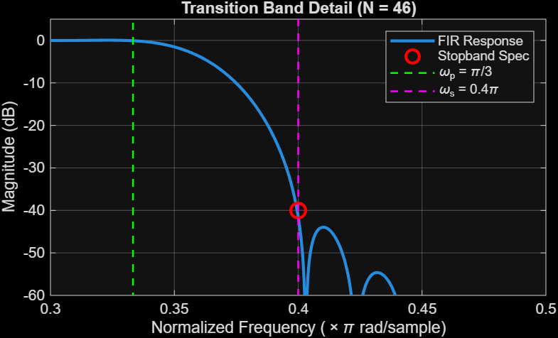
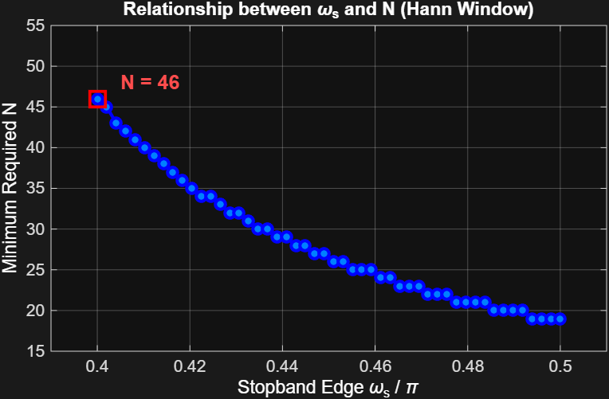

## 2. Part II: 電腦實作與模擬報告 (Computer-based Exercises)
### 設計規格與參數 (Design Specifications)
目標是設計一個低通濾波器，其核心規格如下[cite: 31]：
* **通帶邊界頻率 ($\omega_p$)**：$\pi/3$[cite: 31]
* **阻帶邊界頻率 ($\omega_s$)**：$0.4\pi$[cite: 31]
* **直流增益 ($|H(e^{j0})|$)**：$1$[cite: 31]
* **阻帶衰減要求**：$|H(e^{j(0.4\pi)})| \le 0.01$（相當於 $-40\text{ dB}$）[cite: 31]
* **通帶紋波 (Passband Ripple)**：$\le 0.01$[cite: 31]

### (a) 漢寧窗 (Hann Window) 最小濾波器長度設計
* **視窗選擇與依據**：根據教科書 Table 7.2，Hann 窗的峰值近似誤差小於 $-40\text{ dB}$，完全符合本專案的衰減需求[cite: 31]。
* **實作方式**：透過疊代搜尋與 DTFT 定義驗證頻率響應，求得滿足過渡頻寬需求的最小濾波器長度[cite: 31]。

> 📊 **過渡帶詳情圖解 (Transition Band Detail)**
> 
> *圖 1：在 $\omega_s = 0.4\pi$ 處成功達到 $-40\text{ dB}$ 以下阻帶規格的過渡帶響應細節。*

### (b) 阻帶邊界 $\omega_s$ 對濾波器階數 $N$ 的影響
* **參數變動**：固定誤差要求 $\delta = 0.01$，將阻帶邊界 $\omega_s$ 在 $[0.4\pi, 0.5\pi]$ 區間內變動[cite: 31]。
* **核心觀察**：所需濾波器階數 $N$ 隨著 $\omega_s$ 增加而呈非線性下降，呈現典型的階梯效應（Staircase Effect）[cite: 31]。

> 📈 **$\omega_s$ 與 $N$ 之關係圖**
> 
> *圖 2：隨著 $\omega_s$ 遠離 $\omega_p$，濾波器階數需求逐漸放寬。*

### (c) 效能對比：Hann FIR 濾波器 vs. Butterworth IIR 濾波器
* **計算效率**：Butterworth IIR 濾波器在達到相同 $-40\text{ dB}$ 規格時所需的係數較少，計算效率較高[cite: 31]。
* **相位特性**：FIR 濾波器具備完美的線性相位（Linear Phase），能有效避免非線性相位帶來的訊號失真[cite: 31]。

> 📉 **頻率響應與相位響應比較圖**
> 
> *圖 3：(a) 振幅響應對比；(b) 相位響應對比（展示 FIR 濾波器展現之線性相位特徵）。*